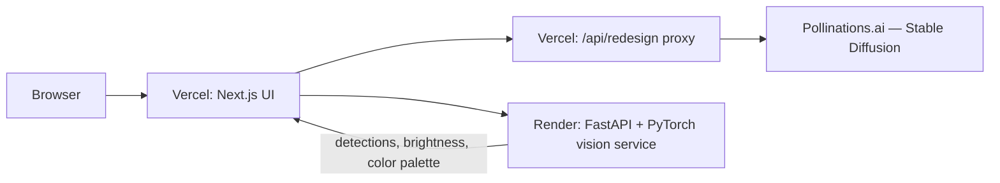

<div align="center">

# RoomSense

**AI-powered room analysis and redesign — real computer vision, real generative AI.**

Upload a photo of a room. RoomSense runs an object-detection model on it to find the actual furniture and fixtures, measures its actual lighting and color palette, hands back professional design recommendations, and generates a real AI redesign in a style you pick.

### 🔗 [**Live Demo**](https://room-sense-qazi-fabia-hoqs-projects.vercel.app) &nbsp;·&nbsp; [API Health Check](https://roomsense-vision-api.onrender.com/health)

*(Backend is on Render's free tier — first request after idle can take ~50s to wake up.)*

[](https://nextjs.org/)
[](https://react.dev/)
[](https://www.typescriptlang.org/)
[](https://tailwindcss.com/)
[](https://fastapi.tiangolo.com/)
[](https://pytorch.org/)
[](https://scikit-learn.org/)
[](https://vercel.com/)
[](https://render.com/)

</div>

---

## What it does

1. **Upload a photo** of any room.
2. A **PyTorch object-detection model** (SSDLite MobileNetV3, trained on COCO) runs inference on the image and draws real bounding boxes around the furniture and fixtures it finds.
3. The backend measures the photo's **actual pixel brightness** (lighting quality) and extracts its **actual dominant colors** with K-Means clustering — no placeholders, no random numbers.
4. The app returns **professional, room-specific design recommendations** (furniture, layout zones, clearances, lighting setup) from a curated interior-design knowledge base.
5. Pick a style and get a **real AI-generated redesign** of the room (Stable Diffusion via Pollinations.ai), downloadable as an image.

---

## Key features

- 📸 **Drag-and-drop photo upload** with a live bounding-box overlay on detected objects
- 🧠 **Real object detection** — not mocked, not random — actual model inference per request
- 💡 **Real lighting & color analysis** computed from the image's pixels
- 🛋️ **Room-specific recommendations** for 8 room types (Living Room, Bedroom, Kitchen, Bathroom, Dining Room, Home Office, Kids Room, Laundry Room)
- 🎨 **AI room redesign** in multiple styles, generated on demand
- 📱 Fully responsive, clean UI built with Tailwind CSS
- 🔗 One-click social sharing

---

## Tech stack

| Layer | Technology |
|---|---|
| **Frontend** | Next.js 14 (App Router), React 18, TypeScript, Tailwind CSS |
| **Backend / API** | FastAPI (Python), Uvicorn |
| **Computer Vision** | PyTorch + torchvision — SSDLite MobileNetV3 (COCO-pretrained) for object detection |
| **Machine Learning** | scikit-learn (K-Means clustering for color palette extraction) |
| **Generative AI** | Pollinations.ai — free hosted Stable Diffusion (Flux) for room redesigns |
| **Image Processing** | Pillow, NumPy |
| **Hosting** | Vercel (frontend + serverless API proxy) · Render (Python ML backend) |

---

## Architecture



The app is split across two services on purpose:

- **`frontend/`** (Vercel) — the Next.js UI, the design-recommendation content, and a lightweight serverless route that proxies AI-redesign image requests.
- **`backend/`** (Render) — a FastAPI service running the actual PyTorch object-detection model. This needs a persistent process that keeps a ~300MB model loaded in memory, which is why it runs on Render rather than Vercel's stateless serverless functions.

---

## Engineering note: what's real vs. curated

An earlier version of this app faked its "AI analysis" with `np.random`. It doesn't anymore — every number the app shows is either a real model output or clearly-labeled curated content:

| Feature | Source | Type |
|---|---|---|
| Furniture/fixture detection | SSDLite MobileNetV3 running inference on your image | Real model inference |
| Lighting rating | Measured pixel brightness of your image | Real computation |
| Color palette | K-Means clustering over your image's actual pixels | Real computation |
| Detection confidence | The object detector's own confidence scores | Real, from the model |
| Room redesign images | Stable Diffusion (Flux) via Pollinations.ai | Real generative AI |
| Furniture/layout recommendations | Curated interior-design knowledge base | Expert content, not model output |
| Room type | Selected by the user | User input, not a prediction |

---

## Running locally

**Backend:**
```bash
cd backend
python -m venv venv && source venv/bin/activate
pip install -r requirements.txt
uvicorn main:app --reload --port 8000
```

**Frontend:**
```bash
cd frontend
npm install
# point lib/config.ts's API_BASE_URL at http://localhost:8000 for local dev
npm run dev
```

---

## License

MIT License — free for personal and commercial use.
